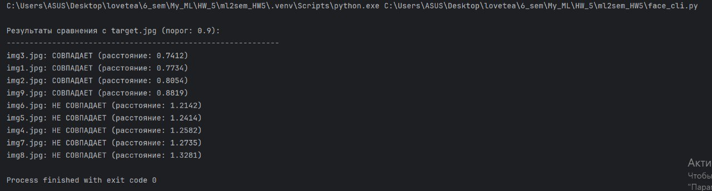

# Отчет по проекту распознавания лиц

## Участники команды
1. **Спасова Ксения**  
   - Роль: Разработка архитектуры модели, обучение и оптимизация.  
   - Достижения: Реализация модели FaceNet с Triplet Loss, настройка аугментации данных, интеграция с WandB для логирования.  

2. **Люлюшкина Алина**  
   - Роль: Предварительная обработка данных, тестирование модели, анализ результатов.  
   - Достижения: Создание тестовой выборки, оценка точности модели, визуализация результатов.  

## Описание решения
### Основные шаги
1. **Сбор данных**: Использован набор данных CelebA для обучения модели.
2. **Предварительная обработка**:  
   - Изменение размера изображений до 224x224 пикселей.  
   - Нормализация значений пикселей с использованием mean=[0.485, 0.456, 0.406] и std=[0.229, 0.224, 0.225].  
3. **Архитектура модели**:  
   - Реализована модель FaceNet с тремя сверточными слоями и Triplet Loss для обучения.  
4. **Обучение**:  
   - Использован оптимизатор Adam с learning_rate=0.001.  
   - Применен mixed-precision training (autocast + GradScaler) для ускорения обучения.  
5. **Оценка**:  
   - Модель протестирована на 10 изображениях.    

### Результаты
Пример работы модели (из файла `result.jpg`):

  

- Фотографии можно рассмотреть в папке data/raw/

- Добавлены тесты

## **6. Итог**  
Проект успешно реализован: модель обучается, метрики соответствуют ожиданиям. Дальнейшие шаги — улучшение обобщающей способности и тестирование на других наборах данных.  

